Getting started with Cacoa
================
Cacoa developers
2026-10-10

- <a href="#load-data" id="toc-load-data">Load data</a>
- <a href="#check-the-design" id="toc-check-the-design">Check the
  design</a>
- <a href="#screen-covariates" id="toc-screen-covariates">Screen
  covariates</a>
- <a href="#set-the-model" id="toc-set-the-model">Set the model</a>
- <a href="#expression-shifts-per-cell-type"
  id="toc-expression-shifts-per-cell-type">Expression shifts per cell
  type</a>
  - <a href="#behind-one-cell-type" id="toc-behind-one-cell-type">Behind one
    cell type</a>
- <a href="#robustness" id="toc-robustness">Robustness</a>
- <a href="#sample-structure" id="toc-sample-structure">Sample
  structure</a>
- <a href="#differential-expression-and-composition-on-the-same-model"
  id="toc-differential-expression-and-composition-on-the-same-model">Differential
  expression and composition on the same model</a>
- <a href="#cluster-free-analyses"
  id="toc-cluster-free-analyses">Cluster-free analyses</a>
- <a href="#session-info" id="toc-session-info">Session info</a>

Cacoa compares samples (patients, donors, replicates) across conditions.
The analysis is organized around one **model**: a formula with the
condition of interest and the covariates to adjust for, and one
**contrast**, the comparison being made. The model is set once and every
analysis uses it: expression shifts per cell type, composition,
differential expression, cell density and the cluster-free analyses.

The recommended order is

1.  `Cacoa$new()` with the sample metadata.
2.  `cao$checkDesign()`: is the planned comparison identifiable from the
    metadata alone?
3.  `cao$screenCovariates()`: which covariates are associated with
    sample-level variation, in which cell types?
4.  `cao$setModel()`: the model and the contrast used from here on.
5.  `cao$estimateExpressionShiftMagnitudes()` and the other analyses.
6.  `cao$checkSensitivity()`: does the result depend on the covariate
    set or on single samples?

This walkthrough uses a **simulated** dataset: 20 samples, 10 treated
and 10 control, and 9 cell types. Expression differences between the
arms were planted with a known strength per cell type: strong in
`IN-SST`, `IN-PV` and `L2/3`; moderate in `OPC`, `L5/6-CC` and `AST-PP`;
weak in `AST-FB`; none in `Microglia` and `Neu-NRGN`. The composition is
the same in both arms. A sample `age` was added as a covariate: the
treated arm is older on average, but age has no effect on expression in
the simulation. The same code runs on any Conos or Seurat object with a
sample metadata table.

``` r
library(cacoa)
library(ggplot2)
```

## Load data

The sample metadata is a data frame with one row per sample (row names
are the sample names) and one column per covariate.

``` r
sim <- readRDS(params$sim.file)
head(sim$sample.meta)
```

        treatment age
    S01   treated  55
    S02   control  50
    S03   treated  46
    S04   treated  55
    S05   control  48
    S06   control  52

``` r
cao <- Cacoa$new(sim$con, sample.metadata = sim$sample.meta, cell.groups = sim$cell.groups, sample.per.cell = sim$sample.per.cell,
                 n.cores = params$n.cores)
```

    Sample metadata: 20 samples, 2 columns
      usable (2): treatment [control 10, treated 10], age [num, 43-72]

    Next: cao$checkDesign() and cao$screenCovariates(), or cao$setModel(test = "<variable>").

The constructor reports which metadata columns can serve as covariates
and which cannot (sample identifiers, constant or mostly missing
columns, too many levels). Options shared by all methods are set once;
explicit arguments of a method call still win. `plot.params` holds
defaults for the embedding plots.

``` r
cao$setOptions(n.permutations = 499, seed = 1)
cao$plot.params <- list(size = 0.3, alpha = 0.3, font.size = 3)
```

## Check the design

Before fitting anything, the metadata alone tells whether the comparison
can be adjusted for the other covariates: associations between
covariates, balance of the arms over them, aliasing, degrees of freedom
and the number of distinct permutations the design allows.

``` r
cao$checkDesign(test = "treatment")
```

    Design check: 20 samples, 2 covariates, test variable 'treatment'
      association with 'treatment': age 0.34
      Note (1):
        - 'age' differs between the levels of 'treatment' (association 0.34) -> adjust for 'age' and compare with the unadjusted result (cao$checkSensitivity())

``` r
cao$plotDesign("balance")
```

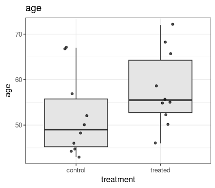<!-- -->

The treated arm is older on average, so age should be adjusted for; the
check suggests comparing the adjusted and the unadjusted result, which
`checkSensitivity()` does below.

## Screen covariates

The screen tests every usable covariate against the sample-to-sample
expression distances of each cell type, alone (marginal) and adjusted
for the other covariates (partial). The last column is a global test
over all cell types. The screen ends with a suggested model; it is not
applied automatically.

``` r
cao$screenCovariates(n.permutations = 199)
```

    Covariate screen: 2 covariates x 9 cell types, marginal + partial mode, permutation p-values (199 permutations)
    Associated with expression in >= 2 cell types (partial, FDR 5%): treatment (7 types, global p 0.005)
    Suggested model: ~treatment   (not applied; see cao$setModel())

``` r
cao$plotCovariateScreen()
```

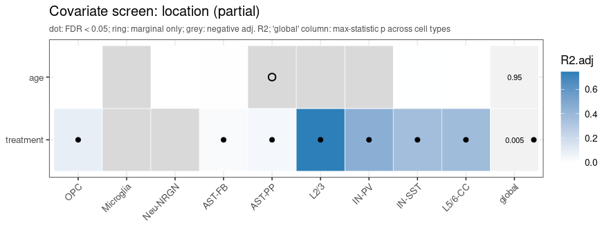<!-- -->

``` r
cao$plotVariancePartition(c("treatment", "age"))
```

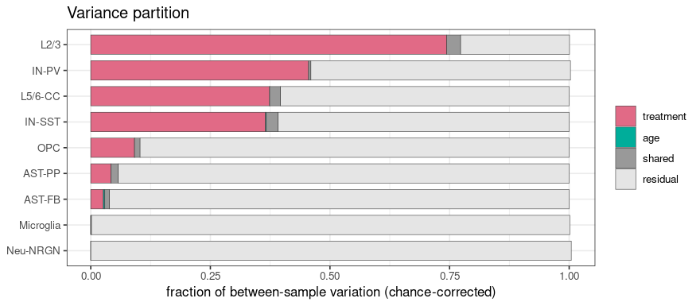<!-- -->

Treatment explains a large part of the between-sample variation in the
planted cell types and none in `Microglia` and `Neu-NRGN`; age explains
nothing, as simulated.

## Set the model

`test` names the variable to test. For a two-level factor the contrast
compares its two levels; the reference level is chosen automatically
(here `control`, matched by name) and
`test = "treatment: control vs treated"` would reverse it. The printout
states the contrast, the adjustment set and the permutation scheme.

``` r
cao$setModel(~ treatment + age, test = "treatment")
```

    Model: ~treatment + age      dispersion: ~treatment
    Test: treatment: treated vs control  (reference 'control': matched a control-like name; to change: test = "treatment: control vs treated")
           adjusted for age; permutations: freedman-lane (> 10 million distinct)
           shift > 0: treated samples differ from control samples in a common direction, beyond within-group variability
    Samples: 20 used.   Issues: 1 note
      note: test 'treatment: treated vs control': continuous covariate(s) age: using Freedman-Lane residual permutation (approximate)

## Expression shifts per cell type

For every cell type, each sample’s cells are pooled into a pseudobulk
profile and the sample-to-sample distances are modelled with the formula
above. The contrast gives three effects:

| effect  | meaning                                                                                   |
|---------|-------------------------------------------------------------------------------------------|
| `shift` | the arms differ in a common direction, beyond the within-arm variability                  |
| `var`   | the treated arm is more (or less) heterogeneous than the control arm                      |
| `total` | treated samples are farther from control samples than control samples are from each other |

The effects are reported on a normalized scale: `shift` relative to the
within-arm distances, `var` as the log2 ratio of the arm dispersions.
P-values come from permutations and are adjusted across cell types
(Benjamini-Hochberg `padj`, and the familywise `p.fwer`); a global
p-value per effect summarizes all cell types.

``` r
res <- cao$estimateExpressionShiftMagnitudes()
res
```

    Expression shifts: treatment: treated vs control; adjusted for age; 499 freedman-lane permutations; distance cor
      celltype  n shift padj.shift   var padj.var total padj.total
          L2/3 17  7.14     0.0026 -0.29     0.98  6.40      0.003
         IN-PV 15  2.12     0.0026  0.73     0.98  3.15      0.003
       L5/6-CC 15  1.41     0.0026 -0.27     0.98  1.20      0.003
        IN-SST 18  1.29     0.0026 -0.02     0.98  1.28      0.003
           OPC 17  0.23     0.0026  0.04     0.98  0.25      0.003
        AST-PP 19  0.11     0.0026  0.02     0.98  0.12      0.003
        AST-FB 16  0.07     0.0026  0.04     0.98  0.09      0.015
     Microglia 19  0.00     0.7900  0.01     0.98  0.00      0.980
      Neu-NRGN 19 -0.01     0.8400  0.00     0.98 -0.01      0.740
      7 of 9 cell types with a significant shift (BH 5%); global p: shift 0.002, var 0.99, total 0.002
      (normalized effects; full tables in $results and $wide)

``` r
cao$plotExpressionShiftMagnitudes()
```

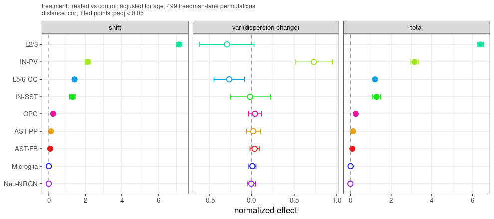<!-- -->

Points are normalized effects with jackknife intervals; filled points
are significant after adjustment across cell types. The planted ordering
is recovered: the three strong cell types on top, the two unchanged ones
at zero.

### Behind one cell type

`plotShiftDetail()` shows the sample-level picture for one cell type:
the samples in the adjusted distance space, the distribution of pair
distances within and between the arms, and the per-sample dispersion.

``` r
cao$plotShiftDetail("IN-SST")
```

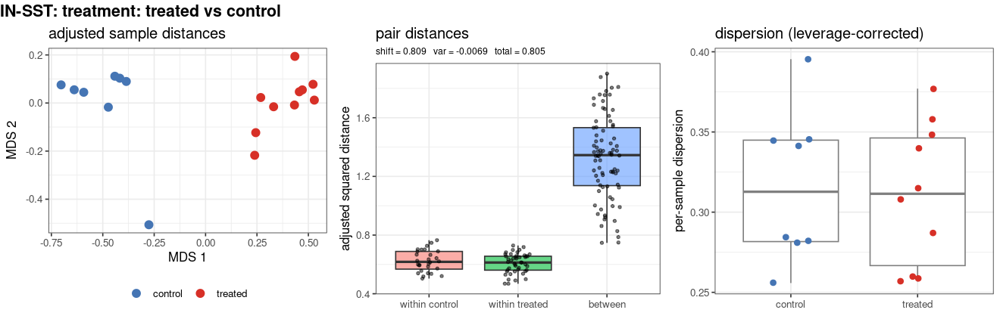<!-- -->

`plotSampleInfluence()` shows how much each sample changes the shift
estimate of each cell type when it is left out, in units of the
jackknife standard error.

``` r
cao$plotSampleInfluence()
```

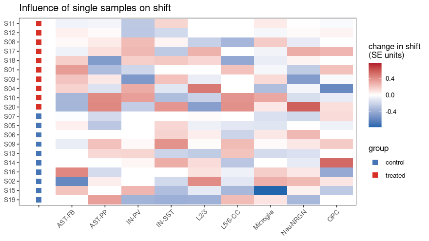<!-- -->

## Robustness

The shifts are re-estimated without adjustment, with the current model,
and with the covariates proposed by the screen. Per cell type, one
verdict summarizes the comparison: robust, sign or significance depends
on the model, the estimate changes by more than half, or the result is
driven by one sample.

``` r
cao$checkSensitivity(n.permutations = 199)
```

    Sensitivity of 'treatment: treated vs control' (shift) across 2 models: unadjusted [~treatment]; current [~treatment + age]
      L2/3                 robust (significant in 2 of 2 models)
      IN-PV                robust (significant in 2 of 2 models)
      L5/6-CC              robust (significant in 2 of 2 models)
      IN-SST               robust (significant in 2 of 2 models)
      OPC                  robust (significant in 2 of 2 models)
      AST-PP               robust (significant in 2 of 2 models)
      AST-FB               robust (significant in 2 of 2 models)
      Neu-NRGN             driven by sample S20 (significant in 0 of 2 models)
      Microglia            driven by sample S15 (significant in 0 of 2 models)

``` r
cao$plotSensitivity()
```

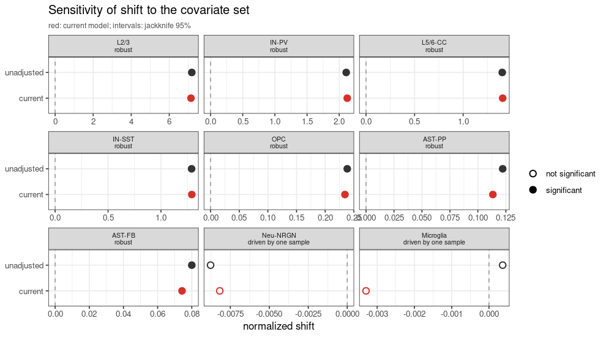<!-- -->

Adjusting for age changes nothing here. The two cell types without a
planted effect are flagged as driven by one sample: their estimates are
at zero and a single sample decides the sign.

## Sample structure

The sample distances of one cell type can be shown before and after the
model adjustment, coloured by the tested variable or by any covariate.

``` r
cao$plotSampleDistances(cell.type = "IN-SST", color.by = "test")
```

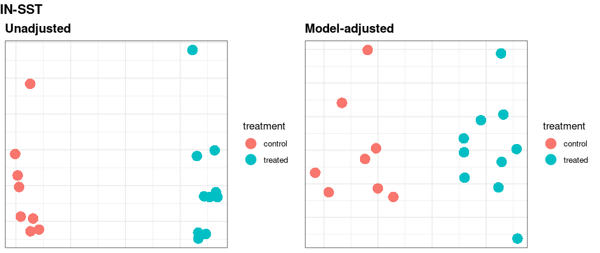<!-- -->

## Differential expression and composition on the same model

The stored model is used by the per-cell-type differential expression,
by the compositional analysis and by the cell density analysis, and is
recorded with each result.

``` r
de <- cao$estimateDEPerCellType(test = "limma-voom", min.cell.count = 5)
head(de[["IN-SST"]]$res[, c("Gene", "log2FoldChange", "pvalue", "padj", "CellFrac")])
```

                 Gene log2FoldChange       pvalue         padj CellFrac
    Gene2526 Gene2526       4.358199 9.105610e-25 2.836398e-21        1
    Gene2406 Gene2406       4.486008 3.562928e-21 5.549260e-18        1
    Gene2241 Gene2241       1.905340 1.319048e-19 1.369612e-16        1
    Gene900   Gene900       3.617855 1.847921e-18 1.439068e-15        1
    Gene3125 Gene3125       2.882086 5.398283e-17 3.363131e-14        1
    Gene2438 Gene2438       2.462065 4.685101e-16 2.432348e-13        1

``` r
cao$plotNumberOfDEGenes()
```

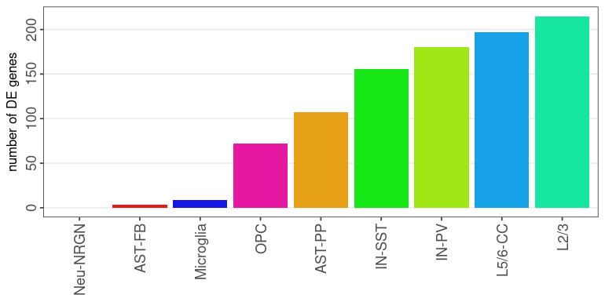<!-- -->

Compositional changes are tested on the same contrast (cell-type
loadings of the treated versus the control arm; here none were planted):

``` r
cao$estimateCellLoadings()
cao$plotCellLoadings(show.pvals = FALSE)
```

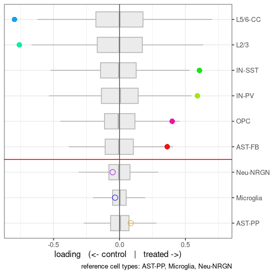<!-- -->

## Cluster-free analyses

Cell density is compared between the arms in every neighbourhood of the
cell graph, with the same adjustment, and the cluster-free expression
shifts test the contrast in every cell’s neighbourhood.

``` r
cao$estimateCellDensity(method = "graph")
cao$estimateDiffCellDensity(type = "permutation")
cowplot::plot_grid(cao$plotEmbedding(color.by = "cell.groups"), cao$plotDiffCellDensity(), ncol = 2)
```

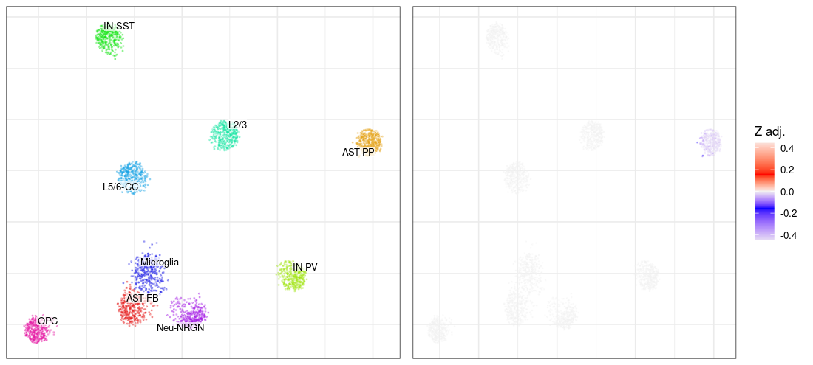<!-- -->

No density differences were simulated and none are found. The expression
shifts, on the other hand, show the planted cell types:

``` r
cao$estimateClusterFreeExpressionShifts(n.top.genes = 500, n.permutations = 99)
cao$plotClusterFreeExpressionShifts()
```

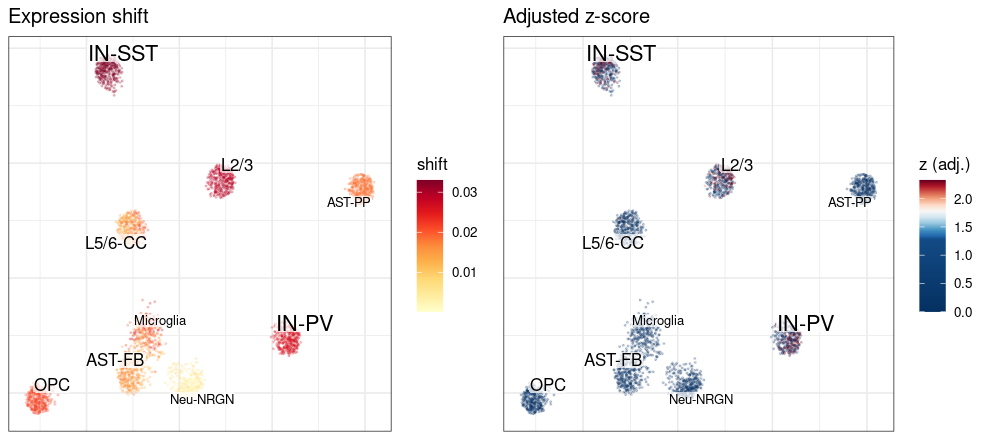<!-- -->

## Session info

``` r
sessionInfo()
```

    R version 4.2.2 Patched (2022-11-10 r83330)
    Platform: x86_64-pc-linux-gnu (64-bit)
    Running under: Ubuntu 20.04.6 LTS

    Matrix products: default
    BLAS:   /usr/lib/x86_64-linux-gnu/blas/libblas.so.3.9.0
    LAPACK: /usr/lib/x86_64-linux-gnu/lapack/liblapack.so.3.9.0

    locale:
     [1] LC_CTYPE=en_US.UTF-8       LC_NUMERIC=C              
     [3] LC_TIME=en_US.UTF-8        LC_COLLATE=en_US.UTF-8    
     [5] LC_MONETARY=en_US.UTF-8    LC_MESSAGES=en_US.UTF-8   
     [7] LC_PAPER=en_US.UTF-8       LC_NAME=C                 
     [9] LC_ADDRESS=C               LC_TELEPHONE=C            
    [11] LC_MEASUREMENT=en_US.UTF-8 LC_IDENTIFICATION=C       

    attached base packages:
    [1] stats     graphics  grDevices utils     datasets  methods   base     

    other attached packages:
    [1] ggplot2_4.0.2  cacoa_0.5.0    Matrix_1.6-1.1

    loaded via a namespace (and not attached):
      [1] spatstat.univar_3.1-4       circlize_0.4.16            
      [3] plyr_1.8.9                  igraph_2.1.4               
      [5] lazyeval_0.2.2              sp_2.2-0                   
      [7] splines_4.2.2               BiocParallel_1.32.6        
      [9] listenv_0.9.1               scattermore_1.2            
     [11] GenomeInfoDb_1.34.9         digest_0.6.37              
     [13] foreach_1.5.2               htmltools_0.5.8.1          
     [15] memoise_2.0.1               magrittr_2.0.3             
     [17] tensor_1.5.1                cluster_2.1.4              
     [19] doParallel_1.0.17           ROCR_1.0-11                
     [21] Biostrings_2.66.0           annotate_1.76.0            
     [23] ComplexHeatmap_2.14.0       globals_0.18.0             
     [25] matrixStats_1.5.0           spatstat.sparse_3.1-0      
     [27] sccore_1.0.6                colorspace_2.1-0           
     [29] blob_1.2.4                  ggrepel_0.9.6              
     [31] xfun_0.53                   dplyr_1.1.4                
     [33] crayon_1.5.2                RCurl_1.98-1.12            
     [35] jsonlite_2.0.0              progressr_0.15.1           
     [37] spatstat.data_3.1-8         survival_3.4-0             
     [39] zoo_1.8-14                  iterators_1.0.14           
     [41] ape_5.8-1                   glue_1.8.0                 
     [43] polyclip_1.10-7             gtable_0.3.6               
     [45] zlibbioc_1.44.0             XVector_0.38.0             
     [47] leiden_0.4.3                DelayedArray_0.24.0        
     [49] GetoptLong_1.0.5            leidenAlg_1.1.5            
     [51] future.apply_1.20.0         shape_1.4.6.1              
     [53] BiocGenerics_0.44.0         abind_1.4-8                
     [55] scales_1.4.0                DBI_1.1.3                  
     [57] spatstat.random_3.4-1       miniUI_0.1.2               
     [59] Rcpp_1.1.0                  coda.base_1.0.3            
     [61] viridisLite_0.4.2           xtable_1.8-4               
     [63] clue_0.3-65                 reticulate_1.43.0          
     [65] bit_4.6.0                   stats4_4.2.2               
     [67] htmlwidgets_1.6.4           httr_1.4.7                 
     [69] RColorBrewer_1.1-3          Seurat_4.3.0.1             
     [71] ica_1.0-3                   XML_3.99-0.14              
     [73] pkgconfig_2.0.3             farver_2.1.2               
     [75] uwot_0.2.3                  deldir_2.0-4               
     [77] locfit_1.5-9.8              AnnotationDbi_1.60.2       
     [79] tidyselect_1.2.1            labeling_0.4.3             
     [81] rlang_1.1.7                 reshape2_1.4.4             
     [83] later_1.4.4                 cachem_1.1.0               
     [85] pbmcapply_1.5.1             tools_4.2.2                
     [87] cli_3.6.5                   RSQLite_2.3.1              
     [89] generics_0.1.4              ggridges_0.5.7             
     [91] evaluate_1.0.5              stringr_1.5.1              
     [93] fastmap_1.2.0               yaml_2.3.10                
     [95] goftest_1.2-3               bit64_4.6.0-1              
     [97] knitr_1.50                  fitdistrplus_1.2-4         
     [99] purrr_1.1.0                 RANN_2.6.2                 
    [101] KEGGREST_1.38.0             pbapply_1.7-4              
    [103] future_1.67.0               nlme_3.1-161               
    [105] mime_0.13                   compiler_4.2.2             
    [107] plotly_4.11.0               png_0.1-8                  
    [109] spatstat.utils_3.1-5        geneplotter_1.76.0         
    [111] tibble_3.3.0                stringi_1.8.7              
    [113] lattice_0.20-45             psych_2.5.6                
    [115] vctrs_0.6.5                 pillar_1.11.0              
    [117] lifecycle_1.0.4             spatstat.geom_3.5-0        
    [119] lmtest_0.9-40               GlobalOptions_0.1.2        
    [121] RcppAnnoy_0.0.22            data.table_1.17.8          
    [123] cowplot_1.2.0               bitops_1.0-9               
    [125] irlba_2.3.5.1               httpuv_1.6.16              
    [127] patchwork_1.3.2             conos_1.5.4                
    [129] GenomicRanges_1.50.2        R6_2.6.1                   
    [131] promises_1.3.3              KernSmooth_2.23-20         
    [133] gridExtra_2.3               IRanges_2.32.0             
    [135] parallelly_1.45.1           codetools_0.2-18           
    [137] MASS_7.3-58                 SummarizedExperiment_1.28.0
    [139] DESeq2_1.38.3               rjson_0.2.21               
    [141] withr_3.0.2                 SeuratObject_4.1.3         
    [143] mnormt_2.1.1                sctransform_0.4.2          
    [145] GenomeInfoDbData_1.2.9      S4Vectors_0.36.2           
    [147] parallel_4.2.2              grid_4.2.2                 
    [149] tidyr_1.3.1                 rmarkdown_2.29             
    [151] MatrixGenerics_1.10.0       S7_0.2.0                   
    [153] Rtsne_0.17                  spatstat.explore_3.5-2     
    [155] Biobase_2.58.0              shiny_1.11.1               
